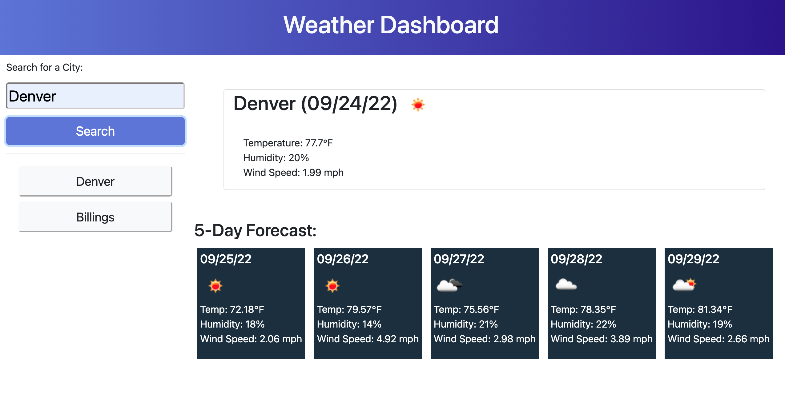

# Weather-Dashboard

## Description
  
This weather dashboard allows a user to search for a city in the U.S. and see current and future weather conditions. The user's search history is also saved and transformed into a clickable list.

## Usage

Search for a city in the U.S. or click on a city in your search history to view current and upcoming weather conditions.

## Features

Dynamic HTML and CSS enhanced by JavaScript, jQuery, moment.js, and Bootstrap.
